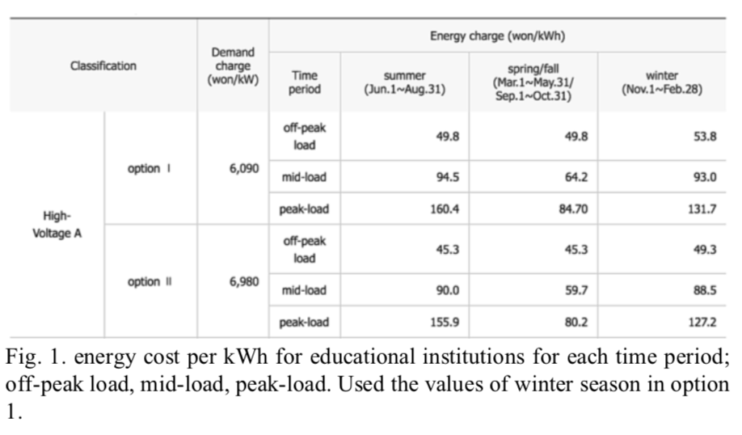
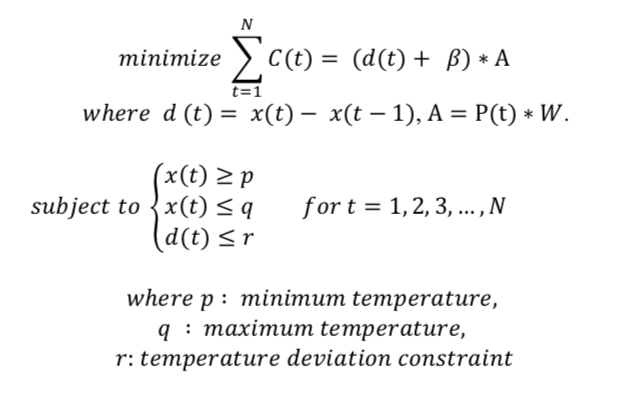
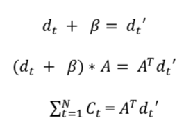
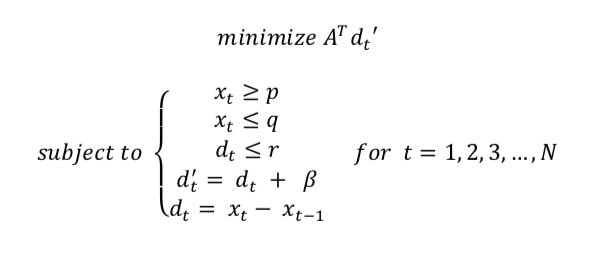
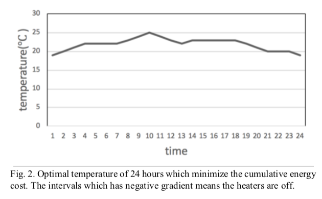

<h1> Optimization of heating cost in DGIST building </h1>
Convex Optimization Term Project
Hyejin Kim(hk3342@nyu.edu)

<h2> Introduction </h2>
The researches for optimizing the energy consumption has been conducted in various fields and contributed considerably to more efficient energy uses in those fields. However, energy consumption optimization algorithms for the buildings are not being widely applied in practices. This is because it is difficult to formulate a general model that can be applied to various buildings with different constraints, environments and structures.
 
On the other hand, in any building it is also important to maintain comfortable temperature for the people using it. In DGIST, there is no efficient algorithm has been applied on in order to regulate the temperature in the buildings and there have been continuous complaints from students about poor temperature control in E7 building.
 
This project aims to suggest an algorithm that maintains the appropriate inner building temperatures while minimizing the energy consumption cost for DGIST buildings specifically.

<h2> Method </h2>

<h3>i.System modeling</h3>
 
The algorithm outputs optimal inner building temperature for given amount of time at interval of one hour. The inner building temperature at certain time 𝑡 is denoted by 𝑥(𝑡). The deviation of temperature d(𝑡) denotes 𝑥(𝑡) − 𝑥(𝑡 − 1), which needs to be constrained to keep the inner building temperature stable. The decrease of temperature in the building per hour without heating should be also considered, which denoted by constant parameter 𝛽. The cost of energy that is consumed to increase the temperature by 1°C is denoted by parameter Α. The cost per per unit differs depending on the energy demand of each time interval and parameter Α can be expressed by Α = P(t) ∗ 𝑊 , where P(t) means the cost of energy unit and 𝑊 means the amount of energy used to increase the temperature of one hectare of inner building by 1°C. In this research, P(t) refers to the table of energy cost per kWh for educational institutions provided by Korea Electric Power Corporation(KEPO).

 

  W is calculated by thermal load, 𝐻(𝑘𝑐𝑎𝑙/ h𝑟) = 𝑎(𝑚2) * h(𝑘𝑐𝑎𝑙/ 𝑚2 h𝑟), where 𝑎 is the heating area and h is heat loss constant. Empirical data of building insulation with window ceiling is used for h.
Using these variables and parameters, the energy cost at time 𝑡 is formulated as 𝐶(𝑡) = (𝑑(𝑡) + 𝛽) * A. The objective function to be minimized is cumulative sum of energy cost per each time 𝑡, which is ∑𝑁𝑡=1 𝐶(𝑡).

<h3>ii.Optimization Problem formulation</h3>
 
From system modeling, the objective function is cumulative sum of energy cost. The optimization problem can be formulated as following.
 
 
 
The temperature distribution 𝑥(𝑡) for N hours can be expressed as a vector variable 𝑋 = {𝑥1,𝑥2,...,𝑥𝑁} and similarly, temperature deviation 𝑑(𝑡) is expressed as 𝐷 = {𝑑 ,𝑑 ,...,𝑑 }.The object function is then transformed as the following form.
 
 
 
Therefore, the problem can be re-written as convex optimization problem as the objective function is Linear Programming(LP) form and the constraints are convex sets.
 
 
 
<h3>iii.Code</h3>
 
The optimization algorithm is implemented in cvxpy, a python-based convex programming library.
The code is in ['linear_programming.py'](https://github.com/hyejin97/Python/blob/main/cvxpy/linear_programming.py)
 

<h2> Result </h2>
The minimum heating energy cost and optimal distribution of temperature for 24 hours is acquired from the optimization result. Minimum temperature was set to 19 °C, maximum temperature to 25°C, and minimum deviation to 2°C are set as constraints. Figure 2 shows the distribution of temperature when the algorithm is applied. The intervals of 10 – 12, 18 – 21, and 23 – 24 has negative gradients, which means that the heating system does not operate in these intervals.

 
 

 
When the inner building temperature continuously operated the heating system to keep the temperature at 19°C, the cumulative sum of energy cost for 24 hours is 1595.594 won/hr. After applying the optimization algorithm, the cumulative energy cost for 24 hours is 1194.27 won/hr, which reduced the cost about 25%.
 

<h2> References </h2>
[1] Thirteen buildings of the Szaserów Housing Cooperative in Warsaw (2010), more than 40 housing associations from Warsaw and surrounding areas
 
[2] K. Louadj, “Optimization of Electricity Consumption in a building.”, IEEE, April 2018
